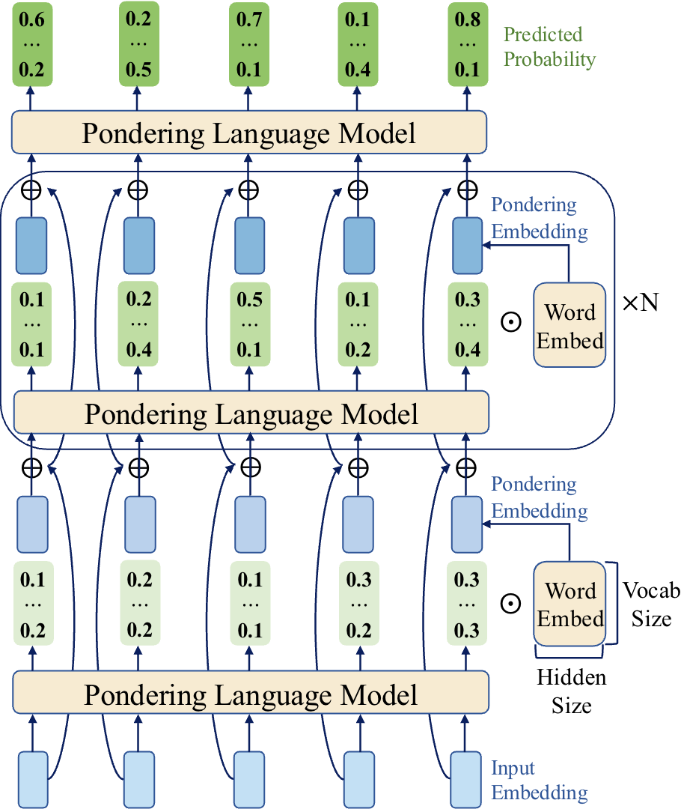
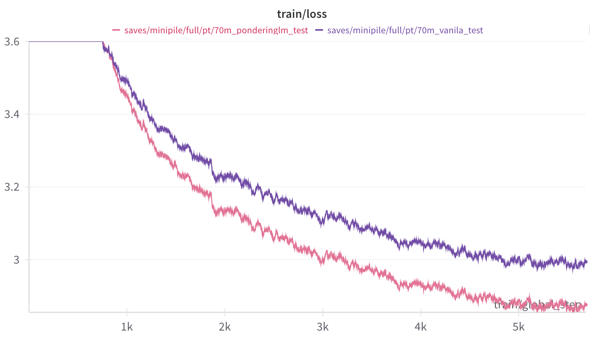

<h1 align="center">Pretraining Language Models to Ponder in Continuous Space</h1>  
This repository contains the official implementation of the paper "Pretraining Language Models to Ponder in Continuous Space".

## Introduction

We introduce the **Pondering Language Model**, which enhances language models by pretraining them to ponder in a continuous space.

For more details, please refer to our [paper](https://arxiv.org/abs/2505.20674)!

<p align="center">
  
</p>

## Code Structure

- The core model modifications are located in [`PonderingLM/src/llamafactory/model/modeling`](https://github.com/hzby/PonderingLM/tree/main/src/llamafactory/model/modeling). We provide `modeling_xxx.py` files for the pondering versions of Pythia, GPT2, and LLaMA, as described in our paper.
- The scripts for running our experiments can be found in [`PonderingLM/experiments_jobs`](https://github.com/hzby/PonderingLM/tree/main/experiments_jobs).

## Environment Setup

To set up the environment, please follow these steps:

```bash
git clone https://github.com/hzby/PonderingLM.git
cd PonderingLM
conda create -n ponderinglm python=3.10
conda activate ponderinglm
pip install -e ".[torch,metrics,deepspeed]"
conda install nvidia/label/cuda-12.1.0::cuda-toolkit
pip install flash-attn==2.7.2.post1 --no-build-isolation
```

## Quick Start Demo: Pretraining Pondering Pythia-70m on Minipile

You can pretrain the pondering Pythia-70m model on the minipile dataset using 8 RTX4090 GPUs with the following command:

```bash
cd PonderingLM
FORCE_TORCHRUN=1 llamafactory-cli train \
  --model_name_or_path EleutherAI/pythia-70m \
  --stage pt \
  --do_train \
  --finetuning_type full \
  --dataset minipile \
  --template default \
  --cutoff_len 2048 \
  --output_dir saves/minipile/full/pt/70m_ponderinglm_test \
  --logging_steps 1 \
  --plot_loss \
  --num_train_epochs 1.0 \
  --per_device_train_batch_size 8 \
  --gradient_accumulation_steps 2 \
  --learning_rate 1.0e-3 \
  --lr_scheduler_type cosine_with_min_lr \
  --warmup_ratio 0.01 \
  --save_steps 2000 \
  --report_to wandb \
  --adam_beta1 0.9 \
  --preprocessing_num_workers 16 \
  --adam_beta2 0.95 \
  --weight_decay 0.01 \
  --ddp_timeout 180000000 \
  --deepspeed examples/deepspeed/ds_z0_config.json \
  --flash_attn fa2 \
  --ponderinglm true \
  --pondering_steps 3 \
  --bf16 \
  --disable_gradient_checkpointing true \
  --scale_embeds true \
  --train_from_scratch true \
  --lr_scheduler_kwargs '{"min_lr_rate":0.1}' 
```

To pretrain a vanilla Pythia-70m model as a baseline, use:

```bash
cd PonderingLM
FORCE_TORCHRUN=1 llamafactory-cli train \
  --model_name_or_path EleutherAI/pythia-70m \
  --stage pt \
  --do_train \
  --finetuning_type full \
  --dataset minipile \
  --template default \
  --cutoff_len 2048 \
  --output_dir saves/minipile/full/pt/70m_vanila_test \
  --logging_steps 1 \
  --num_train_epochs 1.0 \
  --plot_loss \
  --per_device_train_batch_size 8 \
  --gradient_accumulation_steps 2 \
  --save_steps 2000 \
  --learning_rate 1.0e-3 \
  --lr_scheduler_type cosine_with_min_lr \
  --warmup_ratio 0.01 \
  --report_to wandb \
  --adam_beta1 0.9 \
  --preprocessing_num_workers 16 \
  --adam_beta2 0.95 \
  --weight_decay 0.01 \
  --ddp_timeout 180000000 \
  --deepspeed examples/deepspeed/ds_z0_config.json \
  --flash_attn fa2 \
  --bf16 \
  --disable_gradient_checkpointing true \
  --train_from_scratch true \
  --lr_scheduler_kwargs '{"min_lr_rate":0.1}' 
```

If the training runs successfully, you will see loss curves similar to the following: the pink line (pondering 70m) significantly outperforms the purple line (vanilla 70m).

<p align="center">
  
</p>

## Experiments

The main experiment scripts are provided in `PonderingLM/experiments_jobs`.

## Checkpoints

We release our largest pondering Pythia-1.4B model, trained on 300B tokens from the Pile, on Hugging Face: [https://huggingface.co/zeng123/PonderingPythia-1.4B](https://huggingface.co/zeng123/PonderingPythia-1.4B).

## Evaluation

We evaluate our models on downstream tasks using [lm-eval](https://github.com/EleutherAI/lm-evaluation-harness). For MT-Bench, we use the [FastChat LLM Judge](https://github.com/lm-sys/FastChat/blob/main/fastchat/llm_judge/).

## Contact

If you have any questions or encounter issues, feel free to [open an issue](#) or contact [Boyi Zeng](mailto:boyizeng@sjtu.edu.cn) at Shanghai Jiao Tong University.

## Citation

If you find this work useful, please consider citing our paper:

```bibtex
@article{zeng2025pretraining,
  title={Pretraining Language Models to Ponder in Continuous Space},
  author={Zeng, Boyi and Song, Shixiang and Huang, Siyuan and Wang, Yixuan and Li, He and He, Ziwei and Wang, Xinbing and Li, Zhiyu and Lin, Zhouhan},
  journal={arXiv preprint arXiv:2505.20674},
  year={2025}
}

